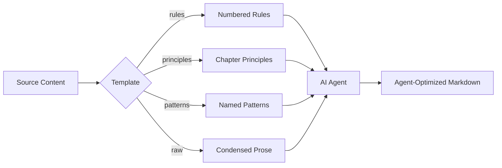
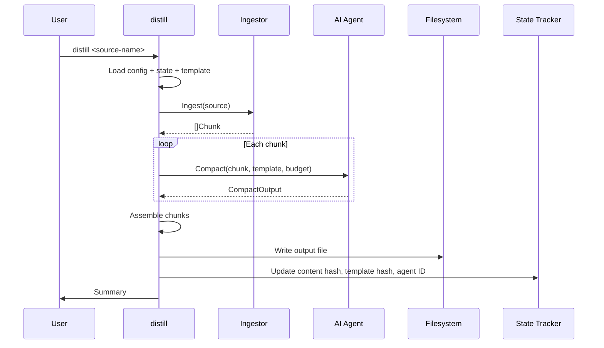
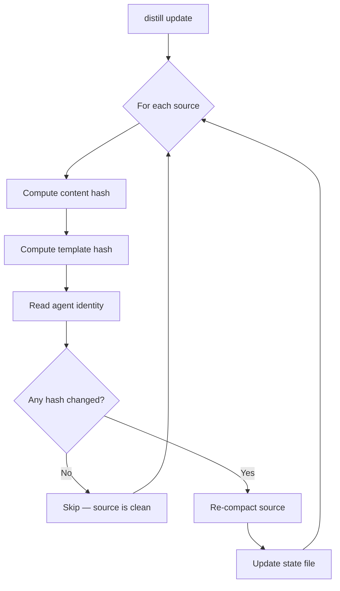

# distill: A Template-Driven Knowledge Compaction Pipeline for AI Agents

**Nicholas Adamou — dotbrains**

## Abstract

AI coding agents are fundamentally constrained by their context windows. Technical books, framework guides, and architectural references contain critical guidance for code generation and review, but their raw form — hundreds of pages of prose, examples, and anecdotes — cannot be loaded into an agent's working context. Teams address this by manually condensing books into numbered rules or principles, but the process is inconsistent, non-repeatable, and disconnected from the distribution mechanism that makes the output available to agents.

This paper presents distill, a Go CLI that automates the compaction of technical source material into agent-optimized markdown. distill makes six technical contributions: (1) a template-driven compaction system with four built-in output formats (rules, principles, patterns, raw) that enforce consistent structure across heterogeneous source material; (2) a multi-source ingestion layer that reads from local files (markdown, PDF, EPUB), remote sources (Notion via MCP, web URLs, GitHub), and directories of files, producing uniform text chunks for the compaction pipeline; (3) a content-hashing state tracker that enables incremental updates — unchanged sources are skipped, and any change to the source content, template, or agent identity triggers re-compaction; (4) a pluggable agent architecture supporting both CLI-based (Claude Code, OpenAI Codex) and API-based (Anthropic Messages, OpenAI Chat Completions) AI providers, with the same provider registry pattern used in the companion tool `prr`; (5) a precedence system that controls which context sources take priority when multiple sources provide conflicting guidance — ensuring that organization-specific decisions override general framework guidelines; and (6) a complete distribution pipeline (`distill init` → `distill publish` → `distill install`) that manages the full lifecycle from context repo creation through team-wide consumption via `~/.claude/docs/`.

## 1. Introduction

Large language models used as coding agents — Claude Code, GitHub Copilot, Warp's Oz, Cursor — produce better output when given domain-specific context. A React agent that knows "group by route/module, not containers/components" writes different code than one operating from general training data. A backend agent that knows "prefer factory functions over classes" and "layer as Handler → Service → Repository" makes different architectural decisions.

This context exists. It is written down in books like *Tao of React*, *Tao of Node*, and *Designing Data-Intensive Applications*. The problem is format: a 400-page book cannot be loaded into a context window. Even with 200K token windows, loading a full book wastes tokens on prose that does not change agent behavior — anecdotes, motivating examples, historical context, and hedged recommendations.

The solution is compaction: distilling a book into the minimum set of rules, principles, or patterns that would change how an agent writes code. This is currently done by hand. An engineer reads the book, extracts what matters, and writes a condensed markdown document. The output varies wildly: some produce numbered rules, others produce bullet points, others produce unstructured notes. The compaction prompt (the implicit criteria for what to keep and what to cut) is never recorded. When a better compaction strategy is discovered, every document must be re-done manually.

distill replaces this manual process with a repeatable pipeline. The engineer points distill at a source (a PDF, a Notion page, a markdown file), selects a template (rules, principles, patterns), and runs a single command. The AI does the compaction, the template enforces the output format, and the result is written to a structured directory with index files that agents can discover and load selectively.

## 2. Background

### 2.1 Agent Context as a First-Class Concern

The emergence of agentic development environments — tools where an AI agent writes, reviews, and refactors code on behalf of the developer — has made context management a first-class engineering concern. Unlike human developers, agents cannot "remember" past experiences or gradually absorb team conventions. Every invocation starts with a blank slate, filled only by the system prompt, user message, and any context documents loaded into the conversation.

This has led to a pattern: teams maintain a shared repository of markdown documents that encode their conventions, and agents load these documents at the start of each task. The documents serve as a compressed knowledge base — the team's collective expertise, formatted for machine consumption.

### 2.2 The Compaction Problem

A technical book is optimized for human learning: it builds concepts incrementally, motivates each idea with examples, explores edge cases, and revisits earlier material. An agent does not learn — it applies. The optimal format for an agent is a flat list of directives with no redundancy, no motivation, and no examples except where the directive is ambiguous without one.

Converting from the first format to the second is a lossy compression problem. The compressor must decide what to keep (rules that change code-writing behavior), what to cut (motivation, history, examples), and how to structure the output (numbered rules, named principles, pattern templates). This decision is the *compaction template* — and it is the key invariant that distill enforces.

### 2.3 Existing Approaches

Teams currently use three approaches to produce agent context:

**Manual condensation.** An engineer reads the book and writes a summary. This produces high-quality output but is time-consuming, non-repeatable, and varies by author. Two engineers condensing the same book will produce different documents.

**Full-text embedding.** The entire book is chunked, embedded, and retrieved via RAG. This avoids manual work but produces context that is noisy (irrelevant chunks), fragmented (no coherent structure), and token-expensive (embedding retrieval adds latency and cost).

**AI-assisted one-off summaries.** An engineer pastes chapters into ChatGPT or Claude and asks for a summary. This is faster than manual condensation but produces inconsistent output: different sessions use different prompts, different models, and different truncation strategies. There is no version tracking, no incremental updates, and no standard output format.

distill addresses the limitations of all three approaches: it uses AI for speed, templates for consistency, and content hashing for repeatability.

## 3. Design

### 3.1 Template-Driven Compaction

The central design decision in distill is that the *output format* is not a suggestion — it is a system prompt that the AI must follow. Each template is a markdown file containing:

- A role description ("You are a technical knowledge compactor").
- An explicit output format with placeholder structure.
- Directives on tone, length, what to include, and what to cut.
- A token budget instruction.

distill ships four built-in templates:

**`rules`** produces numbered imperative rules grouped by section, modeled after the Tao of React/Node condensed guides. Rules are hierarchically numbered (1.1, 1.2, 2.1, ...), written in imperative mood, and limited to 1-2 sentences each. The template ends with a decision tree and core philosophy section.

**`principles`** produces chapter-based core principles with loading guidance, modeled after DDIA chapter summaries. Each principle is independently useful (no forward references), and the output includes "Key Trade-offs" and "When to Apply" sections.

**`patterns`** produces named patterns with Problem/Solution/Rationale/When to Use/When NOT to Use sections.

**`raw`** performs minimal compaction — condensing prose without restructuring. Useful for material that is already reasonably concise.

Templates are loaded at runtime via Go's `embed.FS` for built-ins and from a configurable directory for custom templates. Custom templates use YAML frontmatter for metadata.



### 3.2 Multi-Source Ingestion

distill supports six source types, each with a dedicated ingestor that normalizes the input into a uniform `[]Chunk` representation:

| Type | Input | Ingestion Method |
|---|---|---|
| `markdown` | Local `.md` file or directory | Direct read; directory entries become individual chunks |
| `pdf` | Local PDF file | Text extraction with optional chapter splitting |
| `epub` | Local EPUB file | OPF manifest parsing + XHTML content extraction |
| `notion` | Notion page URL | Claude CLI with Notion MCP (`claude -p --allowedTools "mcp__notion__*"`) |
| `url` | Web page URL | HTTP fetch + readability-style content extraction |
| `github` | File or directory in a GitHub repo | `gh api` for content fetching |

Each ingestor returns `[]Chunk`, where a `Chunk` contains the raw text content and optional metadata (chapter number, chapter title). The compaction pipeline operates uniformly on chunks regardless of their source.

The `markdown` ingestor is fully implemented. When given a directory, it reads all `.md` files in sorted order, treating each file as a separate chunk with auto-assigned chapter numbers. When given a single file, it returns one chunk. Empty files and whitespace-only files are silently skipped.

### 3.3 The Compaction Pipeline

The end-to-end pipeline for a single source follows seven stages:



1. **Config resolution.** Load `distill.yaml` (project-level) or `~/.config/distill/config.yaml` (global). Project config takes precedence.
2. **Template loading.** Resolve the template by name — custom directory first, then built-in `embed.FS`.
3. **Agent creation.** Instantiate the configured agent (or the one specified via `--agent`). The agent is created via a provider registry lookup.
4. **Ingestion.** The appropriate ingestor reads the source and returns chunks.
5. **Compaction.** Each chunk is sent to the agent with the template as the system prompt and the chunk content as the user prompt. The token budget is appended to the template.
6. **Assembly.** Chunk outputs are concatenated. For `split_by: chapter`, each chunk becomes a separate file.
7. **State update.** The content hash, template hash, and agent identity are recorded in `.distill-state.yaml`.

The `--dry-run` flag short-circuits after step 4, printing chunk sizes without calling the AI.

### 3.4 Content-Hashing State Tracker

Re-compacting unchanged sources is wasteful — AI calls are slow and, for API providers, expensive. distill tracks three inputs per source in `.distill-state.yaml`:

- **Content hash**: SHA-256 of the concatenated raw chunk text.
- **Template hash**: SHA-256 of the template prompt.
- **Agent identity**: The agent name (e.g., `claude-cli`).

A source is *dirty* if any of these three values differs from the previous run. `distill update` skips clean sources entirely. `distill update --force` ignores the state and re-compacts everything.

This design means that improving a template prompt automatically triggers re-compaction of all sources that use it. Switching from Claude to GPT triggers re-compaction. Editing the source file triggers re-compaction. No manual intervention is needed.



### 3.5 Pluggable Agent Architecture

distill's agent layer follows the same registry pattern as `prr` [9]. All providers implement a single interface:

```go
type Agent interface {
    Name() string
    Compact(ctx context.Context, input *CompactInput) (*CompactOutput, error)
    Generate(ctx context.Context, systemPrompt, userPrompt string) (string, error)
}
```

Providers register themselves via `init()` functions. The registry maps provider names to factory functions:

```go
var providers = map[string]ProviderFactory{
    "claude-cli": claudecli.New,
    "codex-cli":  codexcli.New,
    "anthropic":  anthropic.New,
    "openai":     openai.New,
}
```

**CLI providers** (`claude-cli`, `codex-cli`) shell out to local binaries. They require no API keys — authentication is handled by the CLI's own subscription. `claude-cli` uses `claude -p --output-format json --system-prompt <template> --model <model>` with the chunk content piped via stdin. `codex-cli` uses `codex exec --json --approval-mode suggest` with the system prompt embedded in the user prompt (Codex does not support a separate `--system-prompt` flag).

**API providers** (`anthropic`, `openai`) make direct HTTP calls to the respective APIs. They require API keys configured via environment variables (`ANTHROPIC_API_KEY`, `OPENAI_API_KEY`). Both providers support `SetBaseURL` and `SetClient` for test injection.

The default agent is `claude-cli` — zero-config for anyone with a Claude Code subscription.

### 3.6 Precedence and Distribution

When a team maintains context from multiple sources — framework guidelines, organization-specific design principles, and foundational reference books — conflicts are inevitable. A framework guide might recommend one error handling pattern while the team's own design principles mandate a different one. Without explicit precedence, agents have no way to resolve the conflict.

distill addresses this with a `precedence` configuration that defines an ordered list of subdirectories from highest to lowest priority:

```yaml
output:
  precedence:
    - design-principles   # org-specific decisions override everything
    - tao                 # framework guidelines second
    - ddia                # reference books third
```

The root `index.md` includes this hierarchy so agents know which source to follow when guidance conflicts. This mirrors the pattern observed in production shared-context repositories, where organization-specific principles are explicitly documented as taking precedence over general framework guidelines.

The distribution side is equally important. Compacted documents are only useful if agents can load them. distill provides three commands that form a complete lifecycle:

1. **`distill init <name>`** scaffolds a new context repo with index.md, .gitignore, and README.
2. **`distill publish --repo <path>`** copies compacted output into the context repo and commits.
3. **`distill install <repo-url>`** clones the context repo into `~/.claude/docs/` (or a custom target) so agents can discover it. If already installed, it pulls the latest changes.

The `install` command also handles a practical detail: if `~/.claude/` is itself a git-managed directory (as it often is for personal agent configuration), `install` automatically adds `docs/` to `~/.claude/.gitignore` to keep the shared context repo separate from the personal config repo.

This three-command pipeline — init, publish, install — means that producing context and consuming context are both single commands, with no manual `git clone`, directory management, or `.gitignore` editing required.

## 4. Output Format and Context Repo Convention

distill's output follows a hierarchical convention designed for selective loading by AI agents:

```
output/
├── index.md                     # Root index — lists subdirectories
├── tao/
│   ├── index.md                 # "Load when working with React or Node.js..."
│   ├── tao-of-react-minified.md
│   └── tao-of-node-minified.md
└── ddia/
    ├── index.md                 # "Load when making data architecture decisions..."
    ├── ddia_01_minified.md
    └── ddia_02_minified.md
```

Each subdirectory has an `index.md` that lists its contents with "Load when" guidance. The root `index.md` lists all subdirectories. This two-level index enables agents to discover what context is available and load only what is relevant to the current task — avoiding the token waste of loading everything.

The output directory is designed to be a git repository. `distill init <name>` scaffolds the structure (index.md, .gitignore, README.md). `distill publish` copies output to a target repo and commits. `distill install <repo-url>` clones the repo into `~/.claude/docs/` on each team member's machine. The full lifecycle — produce, distribute, consume — is handled by distill.

The `.distill-state.yaml` file is excluded from the context repo via `.gitignore`. It is an implementation detail of the compaction pipeline, not a document that agents should load.

## 5. Implementation

distill is implemented in Go as a single static binary with no runtime dependencies. The CLI is built with Cobra [10]. Configuration is managed via `gopkg.in/yaml.v3`. Built-in template prompts are embedded at compile time via `go:embed`.

The package structure mirrors the companion tool `prr` [9]:

- `cmd/` — Cobra commands: compact, add, update, list, agents, templates, validate, init, install, publish, config.
- `internal/agent/` — Agent interface, provider registry, and four provider implementations (claudecli, codexcli, anthropic, openai).
- `internal/config/` — Config loading with project-level → global → defaults precedence.
- `internal/ingest/` — Ingestor interface and source-type implementations.
- `internal/template/` — Template loading (built-in via `embed.FS`, custom from disk) with frontmatter stripping.
- `internal/writer/` — Output file and index generation.
- `internal/state/` — Content hashing and dirty detection via `.distill-state.yaml`.
- `internal/exec/` — Command executor abstraction for testability.

The shared patterns between distill and prr (agent registry, exec abstraction, config loading, Cobra CLI structure, GoReleaser releases) are intentional. A future shared module (`github.com/dotbrains/agentkit`) could deduplicate these, but premature extraction is worse than duplication.

## 6. Testing

### 6.1 Strategy

All tests are unit tests with mocks. There are no integration tests, no real AI calls, and no network access. The test suite uses Go's standard `testing` package with `t.TempDir()` for filesystem fixtures, mock executors for CLI providers, and `net/http/httptest` for API providers.

### 6.2 Coverage

The test suite achieves 82.2% statement coverage across all packages.

| Package | Coverage | What's tested |
|---|---|---|
| `internal/agent/claudecli` | 95.5% | Compact success/error/raw-fallback, Generate, JSON unwrapping, default model |
| `internal/agent/codexcli` | 93.3% | Compact success/error, JSONL event parsing (result/message/raw/empty), default model |
| `internal/template` | 93.3% | All four built-in templates load, custom templates, frontmatter stripping, override precedence |
| `internal/agent/anthropic` | 89.4% | API key validation, Compact success/error/empty, headers, default max tokens |
| `internal/agent/openai` | 88.9% | Same pattern as anthropic, Bearer token, status codes |
| `internal/ingest` | 88.5% | Factory (all types), markdown file/dir/empty/missing/skip-empty, home expansion |
| `internal/state` | 83.3% | HashContent determinism, IsDirty (5 cases), Update (inc. nil map), Save/Load roundtrip |
| `internal/agent` (registry) | 82.4% | Truncate, RegisterProvider, NewAgent (known/unknown), NewAgentFromConfig (default/named/missing) |
| `internal/config` | 78.4% | DefaultConfig, SaveTo/LoadFrom, invalid YAML, Load (project/defaults), paths, CLIProviders |
| `cmd/` | 75.0% | 20 tests via Cobra SetArgs: version, help, all subcommands, compact error paths, dry-run |
| `internal/writer` | 71.4% | WriteOutput, overwrite, WriteIndex |

CLI provider tests use a `mockExecutor` that records stdin and returns canned output. API provider tests use `httptest.NewServer` with handlers that verify headers and return structured JSON. Config and state tests use `t.TempDir()` with `os.Chdir` to isolate filesystem state. Cmd tests create real Cobra command trees and exercise them via `SetArgs`.

## 7. Related Work

**LangChain document loaders** [11] read from PDFs, web pages, and other sources into a chunked format for embedding-based retrieval. This is complementary to distill: LangChain loads documents for RAG, while distill compacts them for direct context injection. RAG retrieves fragments; distill produces complete, structured documents.

**Anthropic's contextual retrieval** [12] enhances RAG by prepending chunk-level summaries. This addresses the coherence problem of RAG but not the token cost problem: retrieved context still contains prose that does not affect agent behavior.

**OpenAI Custom GPTs** allow uploading reference documents that the model can search. The model decides what to retrieve, which introduces latency and non-determinism. distill's approach is deterministic: the entire compacted document is loaded, and the agent applies all rules.

**Cursor rules** (`.cursorrules`) and **Claude project context** (`.claude/docs/`) are static files that agents load at startup. These are the *consumption mechanism* — distill is the *production mechanism* that generates these files from source material.

**prr** [9] is the companion tool that performs AI-powered code review. distill shares prr's agent abstraction, provider registry, executor pattern, and CLI structure. The two tools solve different problems with the same AI interaction layer.

## 8. Limitations and Future Work

**Compaction quality is not validated.** distill validates output format (token count, structure) but not whether the AI produced an accurate or useful compaction. A principle that misrepresents the source material will be written to disk without warning. Quality assessment remains a human responsibility.

**PDF text extraction quality varies.** Technical books with complex layouts, code blocks, tables, and diagrams produce noisy text via standard PDF extraction. OCR-heavy PDFs (scanned books) are not supported. A future version could use vision-capable models to process PDF pages as images.

**No multi-model consensus.** Using a single AI model for compaction risks model-specific biases in what is considered important. A future version could compact with multiple models and merge the results, retaining rules that appear in multiple outputs.

**No feedback loop.** When an agent uses a compacted document and produces poor code as a result, there is no mechanism to trace the failure back to a specific rule and improve it. Integrating distill with code review feedback (e.g., from prr) could close this loop.

**Token counting is approximate.** distill uses the `cl100k_base` tiktoken encoding for token estimation. Different models use different tokenizers, so the actual token count may vary. The budget is treated as a target, not a hard limit.

**Chunk boundaries are naive for non-markdown sources.** The current chunking strategy for large single-file sources splits at natural section breaks. For PDFs, "natural section breaks" depend on the quality of text extraction and heading detection. A future version could use the AI itself to identify optimal split points.

## 9. Conclusion

distill addresses a specific gap in the agentic development toolchain: the production, distribution, and consumption of structured, agent-optimized knowledge from verbose source material. The key insight is that compaction is a *template-constrained AI task*, not a free-form summarization. By fixing the output format via templates, tracking input hashes for incremental updates, enforcing precedence when sources conflict, and providing a complete init → publish → install distribution pipeline, distill makes the entire lifecycle repeatable, consistent, and cheap to maintain.

The tool is deliberately narrow in scope. It does not embed documents for RAG, does not build vector databases, and does not manage agent routing or tool use. It produces markdown files. The simplicity is the point: markdown files are universal, versionable, and readable by every agent platform. A team that maintains a context repo of distill-generated documents gets consistent AI behavior across Warp, Claude Code, Cursor, and any future agent that reads markdown.

The combination of distill (knowledge production and distribution), a shared context repo (knowledge storage), and tools like prr (knowledge consumption via AI-powered review) forms a complete pipeline for encoding human expertise into agent-accessible form.

## References

[1] Anthropic. *Claude Code*. https://docs.anthropic.com/en/docs/claude-code

[2] OpenAI. *Codex CLI*. https://github.com/openai/codex

[3] Anthropic. *Anthropic Messages API*. https://docs.anthropic.com/en/api/messages

[4] OpenAI. *Chat Completions API*. https://platform.openai.com/docs/api-reference/chat

[5] Alex Strick van Linschoten. *Tao of React*. 2023.

[6] Alex Kondov. *Tao of Node*. 2023.

[7] Martin Kleppmann. *Designing Data-Intensive Applications*. O'Reilly Media, 2017.

[8] Notion Labs. *Notion API*. https://developers.notion.com

[9] Nicholas Adamou. *prr: AI-Powered PR Code Review CLI*. https://github.com/dotbrains/prr

[10] Steve Francia. *Cobra: A Commander for modern Go CLI interactions*. https://github.com/spf13/cobra

[11] LangChain. *Document Loaders*. https://docs.langchain.com/docs/components/document-loaders

[12] Anthropic. *Introducing Contextual Retrieval*. https://www.anthropic.com/news/contextual-retrieval

*distill is available at https://github.com/dotbrains/distill under the MIT License.*
