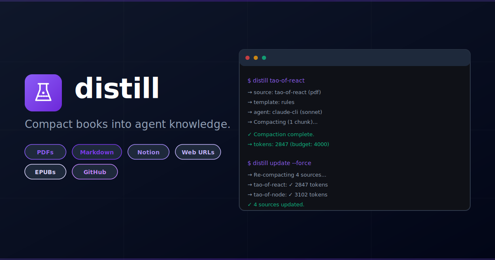

# distill — AI-Powered Knowledge Compactor for Agents



[](https://github.com/dotbrains/distill/actions/workflows/ci.yml)
[](https://github.com/dotbrains/distill/actions/workflows/release.yml)
[](https://opensource.org/licenses/MIT)


Compact technical books, documentation, and reference material into agent-optimized markdown. Outputs structured context repos that plug directly into Warp, Claude Code, or any agent that reads markdown.

## Quick Start

```sh
# Install
go install github.com/dotbrains/distill@latest

# Initialize a config
distill config init

# Add a source
distill add pdf ~/Books/tao-of-react.pdf --name tao-of-react --template rules --output-dir tao

# Compact it
distill tao-of-react

# Add a full book split by chapter
distill add pdf ~/Books/ddia.pdf --name ddia --template principles --output-dir ddia --split-by chapter
distill ddia

# Add a local markdown guide
distill add markdown ./docs/guide.md --name my-guide --template rules

# Re-compact everything
distill update --force

# List tracked sources
distill list

# Scaffold a new context repo
distill init my-context

# Install a shared context repo for your agents
distill install https://github.com/myteam/shared-context.git

# See available templates
distill templates
```

## How It Works

1. **Add a source** — PDF, markdown file, Notion page, web URL, EPUB, or GitHub file.
2. **Choose a template** — `rules` (numbered imperative rules), `principles` (chapter-based), `patterns` (named patterns), or `raw` (minimal compaction).
3. **Compact** — `distill <name>` sends the source through an AI compaction pipeline and writes agent-optimized markdown.
4. **Publish** — Copy output to a context repo that your agents read from (`~/.claude/docs/` or anywhere else).

Output is structured with `index.md` files at every level so agents know what to load and when.

```
output/
├── index.md                      # root index
├── tao/
│   ├── index.md                  # "Load when working with React..."
│   ├── tao-of-react-minified.md
│   └── tao-of-node-minified.md
└── ddia/
    ├── index.md                  # "Load when making data architecture decisions..."
    ├── ddia_01_minified.md
    └── ddia_02_minified.md
```

## Installation

### Via `go install`

```sh
go install github.com/dotbrains/distill@latest
```

### Via Homebrew

```sh
brew tap dotbrains/tap
brew install --cask distill
```

### Via GitHub Release

```sh
gh release download --repo dotbrains/distill --pattern 'distill_darwin_arm64.tar.gz' --dir /tmp
tar -xzf /tmp/distill_darwin_arm64.tar.gz -C /usr/local/bin
```

### From source

```sh
git clone https://github.com/dotbrains/distill.git
cd distill
make install
```

## Configuration

```sh
# Create default config
distill config init

# Config lives at distill.yaml (project-level) or ~/.config/distill/config.yaml (global)
```

Sources, agents, templates, and output settings are all configured in `distill.yaml`. See [SPEC.md](SPEC.md) for the full config format.

## Commands

| Command | Description |
|---|---|
| `distill <name>` | Compact a tracked source |
| `distill add <type> <location>` | Register a new source (pdf, markdown, notion, url, epub, github) |
| `distill update [name]` | Re-compact one or all tracked sources |
| `distill list` | List tracked sources with status |
| `distill templates` | List available compaction templates |
| `distill validate [name]` | Validate output format and token budget |
| `distill init <name>` | Scaffold a new context repo |
| `distill install <repo-url>` | Clone a context repo into `~/.claude/docs/` for agent consumption |
| `distill publish` | Copy output to a context repo and commit |
| `distill agents` | List configured AI agents and their status |
| `distill config init` | Create default config file |

## Templates

| Template | Format | Use for |
|---|---|---|
| `rules` | Numbered imperative rules grouped by section | Framework guides, best practices books |
| `principles` | Chapter-based core principles with loading guidance | Dense technical books (DDIA, etc.) |
| `patterns` | Named patterns with problem/solution/rationale | Design pattern references |
| `raw` | Minimal compaction, preserves original structure | Already-concise material |

Custom templates are supported — add `.md` files to a templates directory and reference them by name.

## Paper

A technical paper describing distill's design and contributions is available in the repo:

[**PAPER.md**](PAPER.md) — covers the template-driven compaction system, multi-source ingestion layer, content-hashing state tracker, pluggable agent architecture, and the full distribution pipeline from context repo creation to team-wide consumption.

## Dependencies

- **[claude](https://docs.anthropic.com/en/docs/claude-code)** — Claude Code CLI (default agent, no API key needed)
- **[git](https://git-scm.com/)** — for `distill publish` and `distill init`

API-based providers (Anthropic, OpenAI) are also supported via config.

## License

MIT
