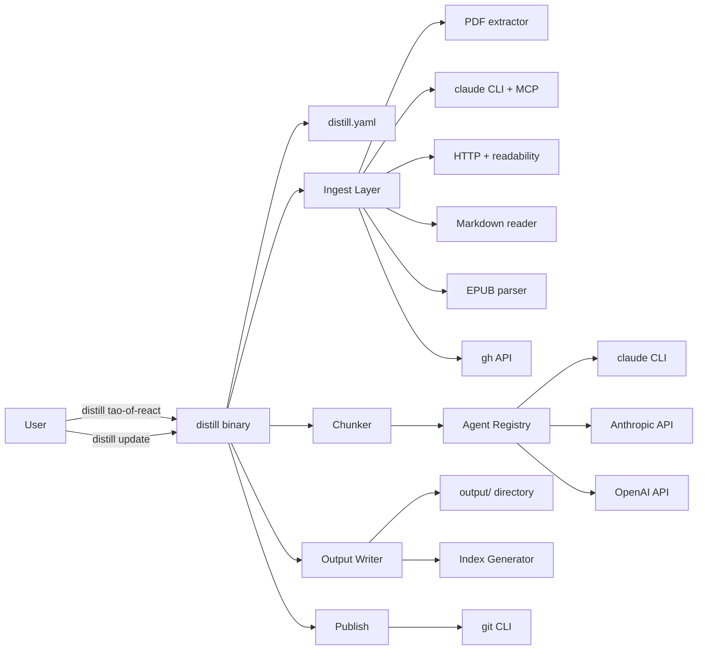
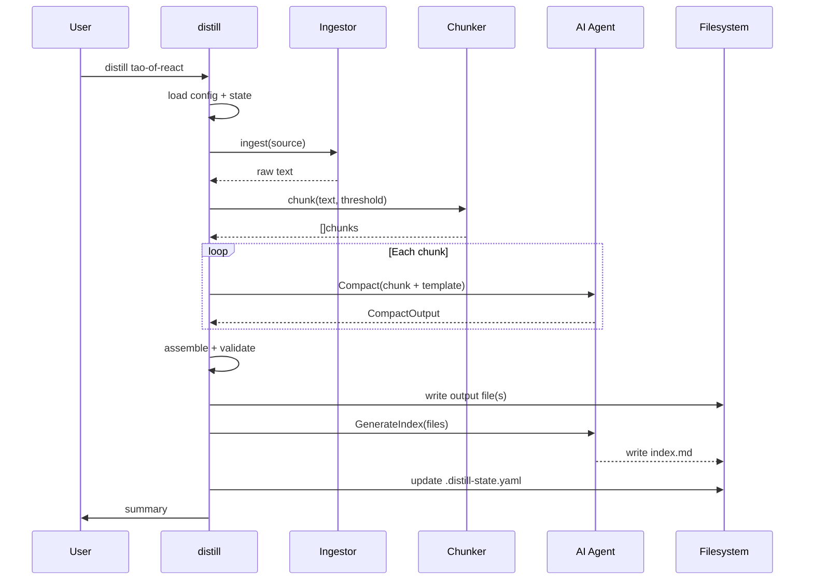

# distill — AI-Powered Knowledge Compactor for Agents


[](https://github.com/dotbrains/distill/actions/workflows/ci.yml)
[](https://github.com/dotbrains/distill/actions/workflows/release.yml)
[](https://opensource.org/licenses/MIT)


A CLI that compacts technical books, documentation, and reference material into agent-optimized markdown — structured, numbered, minimal-token knowledge that AI agents can load as context. Reads PDFs, Notion pages, web docs, and markdown. Outputs structured context repos that plug directly into Warp, Claude Code, or any agent that reads markdown from `~/.claude/docs/`.

## Problem

AI agents are only as good as their context. Technical books like *Tao of React*, *Tao of Node*, and *Designing Data-Intensive Applications* contain invaluable guidance — but at 200-600 pages they're too verbose for agent context windows. Teams solve this by manually distilling books into numbered rules or principles, but:

- **Manual compaction is inconsistent.** Different people produce different formats, varying levels of detail, and miss different things.
- **There's no pipeline.** Each new book is a one-off effort with no repeatable process.
- **Maintenance is manual.** When the source material updates or the compaction prompt improves, every document must be re-done by hand.
- **Distribution is disconnected.** Compacted docs exist in Notion, local files, or scattered repos with no standard structure for agents to discover and load them.

`distill` solves this by providing a repeatable, template-driven pipeline: source material in, agent-optimized markdown out — with proper index files, token budgets, and shared-context conventions baked in.

## How It Fits Together

```
Source Material          distill             Context Repo (any git repo)      Agents
─────────────────       ─────────           ───────────────────────────      ──────
Books (PDF/EPUB)   ──→                 ──→  tao/tao-of-react-minified.md ──→ Warp
Notion pages       ──→  AI compaction  ──→  ddia/ddia_01_minified.md     ──→ Claude Code
Web docs           ──→  + templates    ──→  index.md (auto-generated)    ──→ Any agent
Markdown files     ──→                 ──→  custom/your-doc-minified.md  ──→
```

`distill` is the **producer** — it compacts source material into agent-optimized docs.

The **context repo** is any git repo where compacted docs live. `distill init` scaffolds one, `distill publish` pushes to one. Teams clone it into `~/.claude/docs/` (or wherever their agents read context from). Individuals can also use it locally without sharing.

Agent skills and rules are the **consumers** — they reference docs from the context repo but are a separate concern.

## Configuration

`distill` reads its configuration from `distill.yaml` in the current directory (project-level) or `~/.config/distill/config.yaml` (global). Project-level config takes precedence.

### Config file format

```yaml
default_agent: claude-cli

agents:
  claude-cli:
    provider: claude-cli
    model: sonnet

  claude-api:
    provider: anthropic
    model: claude-sonnet-4-20250514
    api_key_env: ANTHROPIC_API_KEY
    max_tokens: 8192

output:
  dir: ./output                     # where compacted docs are written
  generate_indexes: true            # auto-generate index.md files
  token_budget: 4000                # target max tokens per output file
  precedence:                       # subdirectory priority order (highest first)
    - design-principles             # org-specific decisions override everything
    - tao                           # framework guidelines second
    - ddia                          # reference books third

publish:
  repo: ~/.claude/docs              # default target for `distill publish`

sources:
  tao-of-react:
    type: pdf
    path: ~/Books/tao-of-react.pdf
    template: rules
    output_dir: tao
    output_file: tao-of-react-minified.md
    description: React best practices and component patterns

  tao-of-node:
    type: pdf
    path: ~/Books/tao-of-node.pdf
    template: rules
    output_dir: tao
    output_file: tao-of-node-minified.md
    description: Node.js architecture and async patterns

  ddia:
    type: pdf
    path: ~/Books/designing-data-intensive-applications.pdf
    template: principles
    output_dir: ddia
    split_by: chapter
    output_pattern: ddia_{chapter_num}_minified.md
    description: Data systems architecture and distributed systems principles

  custom-guide:
    type: markdown
    path: ./docs/internal-guide.md
    template: rules
    output_dir: guides
    output_file: internal-guide-minified.md
    description: Team coding conventions and style guide
```

### `distill config init`

Scaffolds a config file with built-in defaults:

```
$ distill config init
✓ Wrote default config to distill.yaml
Edit the file to add your sources and customize templates.
```

Refuses to overwrite an existing file unless `--force` is passed.

## Commands

### `distill <name>`

Compact a single tracked source by name.

Steps:
1. Reads the source definition from config.
2. Ingests the source material (PDF → text, Notion → markdown, URL → extracted content).
3. Splits into chunks if the source exceeds the chunk threshold (configurable, default: 20,000 tokens).
4. For each chunk, sends to the AI agent with the assigned template prompt.
5. Assembles chunk outputs into the final document.
6. Validates the output against the token budget and format rules.
7. Writes the output file to `output_dir/output_file`.
8. Updates the subdirectory's `index.md` if `generate_indexes` is true.
9. Records source metadata (hash, timestamp, template version) in `.distill-state.yaml`.

```
$ distill tao-of-react
→ source:   tao-of-react (notion)
→ template: rules
→ agent:    claude-cli (sonnet)
→ Ingesting from Notion...
→ Compacting (1 chunk, ~3200 tokens)...

✓ Compaction complete.
→ tokens:  2847 (budget: 4000)
→ output:  ./output/tao/tao-of-react-minified.md
→ index:   ./output/tao/index.md (updated)
```

### `distill add <type> <location> [--name <name>] [--template <template>] [--output-dir <dir>]`

Register a new source for tracking.

```
$ distill add pdf ~/Books/clean-architecture.pdf --name clean-arch --template rules --output-dir architecture
✓ Added source "clean-arch" (pdf)
Run `distill clean-arch` to compact it.

$ distill add pdf ~/Books/clean-code.pdf --name clean-code --template rules --split-by chapter
✓ Added source "clean-code" (pdf, split by chapter)
Run `distill clean-code` to compact it.

$ distill add url https://example.com/best-practices --name best-practices --template rules
✓ Added source "best-practices" (url)
```

Appends the source definition to the config file. If `--name` is omitted, derives a name from the filename or URL slug.

### `distill update [name]`

Re-compact one or all tracked sources. Skips sources whose content hash hasn't changed since the last run (unless `--force` is passed).

```
$ distill update
→ Checking 4 sources...
→ tao-of-react:   unchanged (skipped)
→ tao-of-node:    unchanged (skipped)
→ ddia:           source changed → re-compacting...
→ custom-guide:   unchanged (skipped)

✓ 1 source updated, 3 unchanged.

$ distill update --force
→ Re-compacting all 4 sources...
✓ 4 sources updated.
```

### `distill list`

List all tracked sources with their status.

```
$ distill list
  tao-of-react    notion     rules        tao/           2847 tok   ✓ current
  tao-of-node     notion     rules        tao/           3102 tok   ✓ current
  ddia            pdf        principles   ddia/          -          ✗ not yet compacted
  custom-guide    markdown   rules        guides/        1205 tok   ⚠ source changed
```

### `distill validate [name]`

Validate compacted output against format and token budget.

Checks:
- Output file exists and is valid markdown.
- Token count is within budget (warns if >90%, errors if >120%).
- Numbered rules/principles follow the template's expected structure.
- Index files reference all output files in the subdirectory.
- No orphaned output files (output exists but source was removed from config).

```
$ distill validate
  tao-of-react    ✓ valid (2847/4000 tokens)
  tao-of-node     ✓ valid (3102/4000 tokens)
  ddia            ✗ ddia_11_minified.md missing (gap in chapter sequence)
  custom-guide    ⚠ 3891/4000 tokens (97% of budget)
```

### `distill publish [--repo <path>] [--branch <branch>]`

Copy compacted output into a context repo and commit.

Steps:
1. Resolves the target repo (explicit `--repo`, or auto-detects from config `publish.repo`).
2. Copies output files and index files to the repo.
3. Regenerates the root `index.md` if new subdirectories were added.
4. Stages changes with `git add`.
5. Commits with a message listing which sources were updated.
6. Optionally pushes (`--push`).

```
$ distill publish --repo ~/.claude/docs --push
→ Copying output to ~/.claude/docs...
→ Updated: tao/tao-of-react-minified.md, tao/index.md
→ Committed: "distill: update tao-of-react"
→ Pushed to origin/main.
```

### `distill install <repo-url>`

Clone a context repo into `~/.claude/docs/` (or a custom `--target` directory) so AI agents can discover and load the compacted documents.

- If the target already exists as a git repo, pulls the latest changes instead of re-cloning.
- If `~/.claude/` is a git repo, automatically adds `docs/` to its `.gitignore` to keep the repos separate.

```
$ distill install https://github.com/myteam/shared-context.git
→ Cloning into ~/.claude/docs/...
✓ Context repo installed at ~/.claude/docs/
  Agents can now load documents from this directory.

$ distill install https://github.com/myteam/shared-context.git
→ ~/.claude/docs/ already exists, pulling latest...
✓ Context repo updated.
```

### `distill init`

Scaffold a new context repo structure.

```
$ distill init my-context
✓ Created my-context/
    index.md
    .gitignore
    README.md
    distill.yaml
→ Add sources with `distill add` and run `distill <name>` to start compacting.
```

The scaffolded repo is ready to clone into `~/.claude/docs/` or any directory your agents read from.

### `distill templates`

List available compaction templates.

```
$ distill templates
  rules        Numbered imperative rules grouped by section
  principles   Chapter-based core principles with loading guidance
  patterns     Named patterns with rationale and code examples
  raw          Minimal compaction — condense prose, keep structure, no reformatting
```

### Global Flags

| Flag | Description |
|---|---|
| `--agent` | Use a specific configured agent (default: from config) |
| `--force` | Force re-compaction even if source unchanged |
| `--dry-run` | Show what would happen without writing files |
| `--verbose` | Show detailed progress (chunk boundaries, token counts, prompts) |
| `--token-budget` | Override the token budget for this run |
| `--version` | Print the version and exit |
| `--help` | Show help for any command |

## Source Types

### `notion`

Fetches a Notion page via the Claude CLI + Notion MCP integration.

```yaml
some-doc:
  type: notion
  url: https://www.notion.so/org/Page-Name-abc123
```

**Ingestion:** Shells out to `claude -p "Fetch the full contents of this Notion page: <url>" --allowedTools "mcp__notion__*"`. Extracts the markdown content from the response.

**Requirements:** `claude` CLI installed and authenticated with Notion MCP configured.

### `pdf`

Extracts text from a PDF file.

```yaml
some-book:
  type: pdf
  path: ~/Books/the-book.pdf
  split_by: chapter        # optional: split into per-chapter outputs
  chapter_pattern: "^Chapter \\d+"   # optional: regex for chapter detection
```

**Ingestion:** Uses Go PDF text extraction (`pdfcpu` or `unipdf`). For `split_by: chapter`, detects chapter boundaries via heading patterns or the `chapter_pattern` regex.

**Requirements:** Local file access. No external dependencies.

### `markdown`

Reads a local markdown file or directory of markdown files.

```yaml
some-guide:
  type: markdown
  path: ./docs/guide.md              # single file
  # or
  path: ./docs/guides/               # directory — each .md is a chunk
```

**Ingestion:** Reads files directly. If a directory is provided, each `.md` file becomes a separate chunk.

### `url`

Fetches a web page and extracts the main content.

```yaml
some-article:
  type: url
  url: https://example.com/best-practices
```

**Ingestion:** Fetches via HTTP, extracts main content using a readability-style algorithm (strips nav, ads, boilerplate). Falls back to raw HTML → markdown conversion if extraction fails.

### `epub`

Extracts text from an EPUB file.

```yaml
some-book:
  type: epub
  path: ~/Books/the-book.epub
  split_by: chapter
```

**Ingestion:** Parses EPUB structure (OPF manifest + XHTML content files). Each content file or detected chapter becomes a chunk.

### `github`

Fetches a file or directory from a GitHub repo.

```yaml
upstream-guide:
  type: github
  repo: owner/repo
  path: docs/guide.md                # file or directory
  ref: main                          # branch/tag/SHA (default: default branch)
```

**Ingestion:** Uses `gh api` to fetch file contents. For directories, fetches all `.md` files.

## Templates

Templates define how source material is compacted. Each template is a system prompt that instructs the AI on the desired output format.

### Built-in Templates

#### `rules`

Produces numbered, imperative rules grouped by section. Modeled after the Tao of React/Node minified format.

Output format:
```markdown
# {Title} - Condensed Guide

## 1. {Section Name}

**1.1 {Rule Name}** - {Imperative rule in 1-2 sentences. Direct, actionable, no hedging.}

**1.2 {Rule Name}** - {Another rule. Reference specific patterns, names, and structures.}

## 2. {Section Name}

**2.1 {Rule Name}** - ...

## Key Patterns

{2-4 code examples showing the most important patterns. Only when the pattern can't be described in words alone.}

## Quick Decision Tree

- **When to {X}?** {One-line answer}
- **When to {Y}?** {One-line answer}

## Core Philosophy

- {Pithy one-liner summarizing the book's stance}
- {Another}
```

Prompt directives:
- Write in imperative mood ("Do X", not "You should consider doing X").
- One to two sentences per rule. No filler, no hedging.
- Numbered hierarchically: section.rule (1.1, 1.2, 2.1, ...).
- Include code examples only when the pattern is impossible to describe in prose.
- End with a decision tree for the most common trade-off questions.
- Target the token budget — cut ruthlessly, keep only what changes agent behavior.

#### `principles`

Produces chapter-based core principles with loading guidance. Modeled after the DDIA minified format.

Output format:
```markdown
# {Title} - Chapter {N}: {Chapter Name}

**Load full chapter when**: {One-line guidance on when to load this vs. just the index}

## Core Principles

- **{Principle name}** - {2-3 sentence explanation of the principle and why it matters}
- **{Principle name}** - {Another principle}

## Key Trade-offs

- **{Trade-off}**: {One-line framing of the tension}

## When to Apply

- {Concrete scenario where these principles are most relevant}
```

Prompt directives:
- Extract 6-12 core principles per chapter.
- Each principle should be independently useful — no forward references.
- Bold the principle name, then explain in plain English.
- Include a "Key Trade-offs" section for any tensions the chapter discusses.
- Include a "When to Apply" section to help agents decide when to load the full chapter.

#### `patterns`

Produces named patterns with rationale and examples.

Output format:
```markdown
# {Pattern Name}

## Problem

{What situation triggers this pattern. 2-3 sentences.}

## Solution

{The pattern itself. Concrete, implementable. Include code if essential.}

## Rationale

{Why this pattern over alternatives. What trade-offs were accepted.}

## When to Use

- {Specific scenario}
- {Another scenario}

## When NOT to Use

- {Anti-pattern scenario}
```

#### `raw`

Minimal compaction — condenses prose and removes filler but preserves the original document's structure and voice. Useful for material that's already reasonably concise.

### Custom Templates

Users can define custom templates as markdown files containing the system prompt:

```yaml
output:
  custom_templates_dir: ./templates    # directory containing custom .md templates

sources:
  my-doc:
    type: pdf
    path: ./book.pdf
    template: my-custom-template       # matches ./templates/my-custom-template.md
```

Template files follow this format:

```markdown
---
name: my-custom-template
description: One-line description shown in `distill templates`
---

{System prompt instructing the AI on how to compact the source material.}

{Include the desired output format with placeholder variables.}

{Include directives on tone, length, structure, and what to cut.}
```

## How It Works

### Pipeline

```
Source → Ingest → Chunk → Compact → Assemble → Validate → Write → Index
```

1. **Ingest** — Read source material into raw text. PDF → text extraction. Notion → claude MCP fetch. URL → HTTP + content extraction. Markdown/EPUB/GitHub → direct read.

2. **Chunk** — Split into logical sections. Strategy depends on source type:
   - `split_by: chapter` → detect chapter boundaries (heading patterns, page numbers, TOC).
   - Single-file sources → split at natural section breaks if the source exceeds the chunk threshold.
   - Sources under the chunk threshold → single chunk (no splitting).

3. **Compact** — Send each chunk to the AI agent with the template's system prompt. The user prompt includes the raw chunk text and metadata (source name, chapter number, section context). The agent returns compacted markdown.

4. **Assemble** — For multi-chunk sources, combine individual chunk outputs into the final document(s). For `split_by: chapter`, each chunk becomes a separate output file. For single-output sources, chunks are concatenated with section headers.

5. **Validate** — Check the output:
   - Token count within budget.
   - Numbered rules/principles follow expected structure (no gaps, correct hierarchy).
   - Markdown is well-formed.
   - If validation fails, log a warning (does not block output by default; `--strict` makes it an error).

6. **Write** — Write the output file(s) to `output_dir/output_file`.

7. **Index** — Regenerate the subdirectory's `index.md` by scanning all output files and building the index entries. The index format includes file references, "Load when" guidance, and core topics.

### Content Hashing

`distill` tracks source content hashes in `.distill-state.yaml` to skip unchanged sources on `distill update`. The hash covers:
- Source content (file hash, Notion page last-edited timestamp, URL response hash).
- Template version (built-in templates have a version string; custom templates are hashed by content).
- Agent and model (changing agents may produce different output).

If any of these change, the source is marked dirty and re-compacted on the next `update`.

### Token Counting

Token counts use the `tiktoken` library (Go port) with the `cl100k_base` encoding (used by Claude and GPT-4). The token budget is a target, not a hard limit — the AI is instructed to stay within it, and validation warns if the output exceeds it.

### Index Generation

When `generate_indexes` is true, `distill` auto-generates `index.md` files at two levels:

**Subdirectory index** (e.g., `tao/index.md`):
- Lists all output files in the directory.
- For each file: name, "Load when" guidance (derived from the template), key topics.

**Root index** (`index.md`):
- Lists all subdirectories.
- For each: name, description, "Load" reference to subdirectory index.
- Includes the priority/precedence hierarchy and typical workflow.

Index content is generated by the AI based on the compacted docs, not from static templates. This ensures the "Load when" guidance is contextually accurate.

## Agent Architecture

Same pluggable architecture as [`prr`](https://github.com/dotbrains/prr). All AI providers implement a single interface:

```go
type Agent interface {
    Name() string
    Compact(ctx context.Context, input *CompactInput) (*CompactOutput, error)
    GenerateIndex(ctx context.Context, input *IndexInput) (string, error)
}
```

### Types

```go
type CompactInput struct {
    SourceName   string          // e.g., "tao-of-react"
    ChunkIndex   int             // 0-indexed chunk number
    TotalChunks  int             // total chunks for this source
    Content      string          // raw text of this chunk
    Template     string          // system prompt from the template
    TokenBudget  int             // target max tokens for output
    Metadata     SourceMetadata  // source type, chapter info, etc.
}

type CompactOutput struct {
    Content    string  // compacted markdown
    TokenCount int     // token count of output
}

type IndexInput struct {
    Directory   string          // subdirectory name
    Files       []IndexEntry    // output files to index
    IsRoot      bool            // true for root index, false for subdirectory
}

type IndexEntry struct {
    Path        string
    Title       string
    TokenCount  int
    Template    string
    Topics      []string        // extracted from compacted content
}

type SourceMetadata struct {
    Type         string         // pdf, notion, markdown, url, epub, github
    ChapterNum   int            // for split_by: chapter
    ChapterTitle string
    SectionCtx   string         // surrounding section context for continuity
}
```

### Providers

Same registry pattern as `prr`:

```go
var providers = map[string]ProviderFactory{
    "claude-cli": claudecli.New,   // default — shells out to claude CLI
    "anthropic":  anthropic.New,   // Anthropic Messages API
    "openai":     openai.New,      // OpenAI Chat Completions API
}
```

CLI providers (`claude-cli`) are the default since they require no API keys.

## Output Format

### Conventions

Output follows a hierarchical index convention designed for agent consumption:

1. **Every subdirectory has an `index.md`** listing its contents with loading guidance.
2. **Root `index.md`** lists all subdirectories with descriptions and priority hierarchy.
3. **File names are kebab-case** with `-minified.md` suffix.
4. **Content is agent-optimized** — numbered rules, bold principle names, imperative tone, minimal tokens.
5. **No front matter in output files** — plain markdown. Metadata is in `.distill-state.yaml`.

### Directory Structure

```
output/
├── index.md                              # root index (auto-generated)
├── tao/
│   ├── index.md                          # subdirectory index
│   ├── tao-of-react-minified.md          # compacted output
│   └── tao-of-node-minified.md
├── ddia/
│   ├── index.md
│   ├── ddia_01_minified.md
│   ├── ddia_02_minified.md
│   └── ...
└── guides/
    ├── index.md
    └── internal-guide-minified.md
```

### State File

`.distill-state.yaml` tracks compaction state. Not committed to the output repo — it's local to wherever `distill` runs.

```yaml
sources:
  tao-of-react:
    content_hash: "sha256:abc123..."
    template_hash: "sha256:def456..."
    agent: "claude-cli:sonnet"
    last_compacted: "2025-03-20T14:00:00Z"
    output_tokens: 2847
    output_files:
      - tao/tao-of-react-minified.md

  ddia:
    content_hash: "sha256:789abc..."
    template_hash: "sha256:012def..."
    agent: "claude-cli:sonnet"
    last_compacted: "2025-03-20T14:05:00Z"
    output_tokens: 38420
    output_files:
      - ddia/ddia_01_minified.md
      - ddia/ddia_02_minified.md
      - ...
```

## Architecture



### Compaction Pipeline



## Package Structure

```
distill/
├── main.go                          # Entry point, version injection
├── cmd/                             # Cobra commands
│   ├── root.go                      # Root command, global flags
│   ├── compact.go                   # `distill <name>` — single source compaction
│   ├── compact_test.go
│   ├── add.go                       # `distill add` — register new source
│   ├── add_test.go
│   ├── update.go                    # `distill update` — re-compact dirty sources
│   ├── update_test.go
│   ├── list.go                      # `distill list` — show tracked sources
│   ├── list_test.go
│   ├── validate.go                  # `distill validate` — check output
│   ├── validate_test.go
│   ├── publish.go                   # `distill publish` — push to shared repo
│   ├── publish_test.go
│   ├── init.go                      # `distill init` — scaffold context repo
│   ├── templates.go                 # `distill templates` — list templates
│   └── config.go                    # `distill config init`
├── internal/
│   ├── agent/                       # Agent abstraction layer (shared pattern with prr)
│   │   ├── agent.go                 # Agent interface + types
│   │   ├── registry.go              # Provider registry
│   │   ├── registry_test.go
│   │   ├── claudecli/               # Claude CLI provider (default)
│   │   │   ├── claudecli.go
│   │   │   └── claudecli_test.go
│   │   ├── anthropic/               # Anthropic API provider
│   │   │   ├── anthropic.go
│   │   │   └── anthropic_test.go
│   │   └── openai/                  # OpenAI API provider
│   │       ├── openai.go
│   │       └── openai_test.go
│   ├── config/                      # Configuration loading
│   │   ├── config.go                # Load/save distill.yaml + global config
│   │   └── config_test.go
│   ├── ingest/                      # Source ingestion
│   │   ├── ingestor.go              # Ingestor interface + factory
│   │   ├── pdf.go                   # PDF text extraction
│   │   ├── pdf_test.go
│   │   ├── notion.go                # Notion fetch via claude CLI
│   │   ├── notion_test.go
│   │   ├── markdown.go              # Local markdown reader
│   │   ├── markdown_test.go
│   │   ├── web.go                   # URL fetch + content extraction
│   │   ├── web_test.go
│   │   ├── epub.go                  # EPUB parser
│   │   ├── epub_test.go
│   │   └── github.go               # GitHub file fetch via gh
│   │       └── github_test.go
│   ├── chunk/                       # Content chunking
│   │   ├── chunker.go               # Split content into logical chunks
│   │   ├── chunker_test.go
│   │   ├── chapter.go               # Chapter boundary detection
│   │   └── chapter_test.go
│   ├── template/                    # Compaction templates
│   │   ├── template.go              # Template loading (built-in + custom)
│   │   ├── template_test.go
│   │   ├── rules.go                 # "rules" template prompt
│   │   ├── principles.go            # "principles" template prompt
│   │   ├── patterns.go              # "patterns" template prompt
│   │   └── raw.go                   # "raw" template prompt
│   ├── writer/                      # Output file generation
│   │   ├── writer.go                # Write compacted output + state file
│   │   ├── writer_test.go
│   │   ├── index.go                 # Index file generation
│   │   └── index_test.go
│   ├── state/                       # Compaction state tracking
│   │   ├── state.go                 # Load/save .distill-state.yaml, content hashing
│   │   └── state_test.go
│   ├── token/                       # Token counting
│   │   ├── counter.go               # tiktoken-based token counter
│   │   └── counter_test.go
│   ├── publish/                     # Shared repo publishing
│   │   ├── publisher.go             # Copy output + git commit/push
│   │   └── publisher_test.go
│   └── exec/                        # Command execution abstraction
│       └── executor.go              # CommandExecutor interface (shared pattern with prr)
├── templates/                       # Built-in template prompts (embedded via go:embed)
│   ├── rules.md
│   ├── principles.md
│   ├── patterns.md
│   └── raw.md
├── .github/workflows/
│   ├── ci.yml                       # CI: test, lint, build
│   └── release.yml                  # Release via GoReleaser
├── .goreleaser.yaml                 # Cross-compilation config
├── Makefile                         # build, test, lint, install targets
├── SPEC.md                          # This file
└── README.md                        # User-facing documentation
```

## Testing Strategy

Target: **≥ 80% code coverage**. Tests must not require real API keys, network access, or actual PDF/EPUB files.

### Unit Tests

| Area | What to test | Mocking approach |
|---|---|---|
| **Config loading** | Load from YAML, defaults, invalid YAML, source validation, template resolution | Temp directory with fixture files |
| **PDF ingestion** | Text extraction, chapter detection, encoding handling, corrupted files | Fixture PDFs (small, synthetic) |
| **Notion ingestion** | Claude CLI invocation, response parsing, error handling | Mock exec |
| **Markdown ingestion** | Single file, directory, empty files, encoding | Temp directory |
| **Web ingestion** | Content extraction, fallback to raw, timeouts, redirects | Mock HTTP server (`httptest`) |
| **EPUB ingestion** | XHTML parsing, chapter splitting, metadata extraction | Fixture EPUBs (synthetic) |
| **GitHub ingestion** | `gh api` invocation, directory listing, single file | Mock exec |
| **Chunking** | Under threshold (no split), chapter detection, boundary accuracy, empty input | Pure logic, fixture texts |
| **Template loading** | Built-in resolution, custom file loading, missing template error | Temp directory |
| **Agent registry** | Known/unknown provider, factory invocation | Pure logic |
| **Claude CLI agent** | Command construction, response parsing, stdin piping, error handling | Mock exec |
| **API agents** | Request format, response parsing, rate limit handling, auth errors | Mock HTTP (`httptest`) |
| **Output writer** | Directory creation, file content, state file update | Temp directory |
| **Index generation** | Subdirectory index format, root index format, empty directory | Temp directory |
| **State tracking** | Hash computation, dirty detection, state persistence, agent change detection | Temp directory |
| **Token counting** | Accuracy against known strings, budget enforcement | Pure logic |
| **Validation** | Token budget check, structure validation, gap detection, orphan detection | Fixture files |
| **Publish** | File copying, git command construction, commit message format | Mock exec + temp directory |

### Integration Tests

End-to-end tests using fixture sources (small markdown files) and a mock agent that returns canned compacted output. These verify the full pipeline without real AI calls.

| Test | What's verified |
|---|---|
| Single source compaction | Ingest → chunk → compact → write → index (full pipeline) |
| Multi-chunk source | Chunking + assembly produces correct multi-section output |
| Update with unchanged source | Skips compaction, no output changes |
| Update with changed source | Re-compacts and updates state |
| Add + compact | Config modification + pipeline execution |
| Publish flow | Output copied to target repo, git commands issued correctly |
| Custom template | User-defined template loaded and used in compaction |

### What is NOT Tested

- Real AI API calls (requires API keys and costs money).
- Real Notion MCP integration (requires claude CLI + Notion auth).
- Compaction quality (subjective — manual QA).
- Large PDF parsing (use small synthetic fixtures instead).

### CI

Tests run on every push. Coverage is measured per-package and enforced at ≥ 80%.

## GitHub Actions

### CI — `.github/workflows/ci.yml`

Triggered on push to `main` and all pull requests.

**Jobs:**

1. **test**
   - Matrix: `go: [stable]`, `os: [ubuntu-latest, macos-latest]`
   - Steps: checkout → setup Go → `go vet ./...` → `go test -race -coverprofile=coverage.out ./...` → enforce ≥ 80% coverage → upload coverage artifact

2. **lint**
   - Uses `golangci/golangci-lint-action@v8`
   - Runs `golangci-lint run`

3. **build**
   - Runs `go build -o distill .` to verify the binary compiles
   - Runs on both macOS and Linux

### Release — `.github/workflows/release.yml`

Triggered on tags matching `v*`.

Uses GoReleaser to build, package, and publish.

```yaml
version: 2

builds:
  - binary: distill
    goos: [darwin, linux]
    goarch: [amd64, arm64]
    ldflags:
      - -s -w -X main.version={{.Version}}

homebrew_casks:
  - repository:
      owner: dotbrains
      name: homebrew-tap
      token: "{{ .Env.HOMEBREW_TAP_TOKEN }}"
    name: distill
    homepage: https://github.com/dotbrains/distill
    description: AI-powered knowledge compactor for agents
    license: "MIT"
    binaries: [distill]

archives:
  - formats: [tar.gz]
    name_template: "{{ .ProjectName }}_{{ .Os }}_{{ .Arch }}"

checksum:
  name_template: checksums.txt

changelog:
  sort: asc
  filters:
    exclude:
      - "^docs:"
      - "^chore:"
```

## Installation

### Via `go install`

```sh
go install github.com/dotbrains/distill@latest
```

### Via Homebrew

```sh
brew tap dotbrains/tap
brew install --cask distill
```

### Via GitHub Release

```sh
gh release download --repo dotbrains/distill --pattern 'distill_darwin_arm64.tar.gz' --dir /tmp
tar -xzf /tmp/distill_darwin_arm64.tar.gz -C /usr/local/bin
```

### From source

```sh
git clone https://github.com/dotbrains/distill.git
cd distill
make install
```

## Example Workflows

### Compact a book

```
$ distill add pdf ~/Books/tao-of-react.pdf --name tao-of-react --template rules --output-dir tao
✓ Added source "tao-of-react" (pdf)

$ distill tao-of-react
→ source:   tao-of-react (pdf)
→ template: rules
→ agent:    claude-cli (sonnet)
→ Ingesting PDF...
→ Compacting (1 chunk, ~3200 tokens)...

✓ Compaction complete.
→ tokens:  2847 (budget: 4000)
→ output:  ./output/tao/tao-of-react-minified.md
→ index:   ./output/tao/index.md (updated)
```

### Compact a full book by chapter

```
$ distill add pdf ~/Books/ddia.pdf --name ddia --template principles --output-dir ddia --split-by chapter
✓ Added source "ddia" (pdf, split by chapter)

$ distill ddia
→ source:   ddia (pdf, 12 chapters)
→ template: principles
→ agent:    claude-cli (sonnet)
→ Ingesting PDF...
→ Detected 12 chapters
→ Compacting chapter 1/12...
→ Compacting chapter 2/12...
  ...
→ Compacting chapter 12/12...

✓ Compaction complete.
→ total tokens: 38,420 (avg 3,202/chapter)
→ output:  ./output/ddia/ (12 files)
→ index:   ./output/ddia/index.md (generated)
→ root:    ./output/index.md (updated)
```

### Update all sources after improving a template

```
$ distill update --force
→ Re-compacting 4 sources...
→ tao-of-react:   ✓ 2847 tokens
→ tao-of-node:    ✓ 3102 tokens
→ ddia:           ✓ 38420 tokens (12 chapters)
→ custom-guide:   ✓ 1205 tokens

✓ 4 sources updated.
```

### Publish to a context repo

```
$ distill publish --repo ~/.claude/docs --push
→ Copying output to ~/.claude/docs...
→ Updated 15 files across 3 directories
→ Regenerated root index.md
→ Committed: "distill: update tao-of-react, tao-of-node, ddia, custom-guide"
→ Pushed to origin/main.
```

### First-time setup

```
$ distill config init
✓ Wrote default config to distill.yaml

$ distill add pdf ~/Books/pragmatic-programmer.pdf --name pragmatic --template rules
✓ Added source "pragmatic"

$ distill pragmatic
→ ...
✓ Compaction complete.
```

## Design Decisions

### 1. Templates over free-form compaction

Rather than letting the AI decide how to structure the output, `distill` uses explicit templates with strict format rules. This ensures consistency across sources — every "rules" output looks like Tao of React, every "principles" output looks like DDIA. The AI is creative within the template's constraints, not with the structure itself.

### 2. Content hashing for incremental updates

`distill update` is designed to be run frequently (e.g., in CI or after a `git pull` of source material). Content hashing makes this cheap — unchanged sources are skipped entirely. The hash covers source content, template version, and agent identity, so changing any of these triggers re-compaction.

### 3. Agent abstraction shared with prr

The agent interface and provider registry follow the same pattern as `prr`. This is intentional — the two tools solve different problems but share the same AI interaction layer. A future shared module (`github.com/dotbrains/agentkit`) could deduplicate this, but premature extraction is worse than duplication.

### 4. Claude CLI as default provider

The `claude-cli` provider shells out to the `claude` binary, which handles auth via existing Claude Code subscriptions. This is the lowest-friction option — no API keys to manage. The Notion ingestor also uses the claude CLI (with MCP), keeping the dependency surface small.

### 5. Token budgets as targets, not hard limits

The AI is instructed to target the token budget, and validation warns if the output exceeds it. But the output is never truncated or rejected automatically. Compaction quality is more important than hitting an exact number — a 4,100 token output that covers everything is better than a 3,900 token output that misses key principles.

### 6. Index generation via AI, not static templates

Index files are generated by the AI based on the actual compacted content. This ensures "Load when" guidance and topic lists are contextually accurate rather than generic. The alternative (template-based indexes with title/filename only) produces indexes that don't actually help agents decide what to load.

### 7. Separate state file from output

`.distill-state.yaml` is kept separate from the output directory and is not published to the context repo. The output repo should contain only markdown that agents consume. Build metadata (hashes, timestamps, agent versions) is an implementation detail of the compaction pipeline.

### 8. Go for implementation

Single static binary with no runtime dependencies. Same toolchain as `prr`, enabling shared patterns and eventual shared modules. Cross-compiles to macOS and Linux. PDF and EPUB parsing have adequate Go libraries (`pdfcpu`, `go-epub`).

## Non-Goals

- **Real-time compaction.** `distill` runs to completion and writes files. No streaming, no watch mode.
- **Compaction quality evaluation.** The tool validates format and token count, not whether the AI produced good output. Quality is assessed by humans.
- **Source material hosting.** `distill` reads sources but doesn't store them. The user manages their own PDFs, Notion pages, etc.
- **Agent skill generation.** `distill` produces context docs, not SKILL.md files. Skills that reference these docs are a separate concern.
- **Multi-language output.** English only. Compacting source material in other languages is technically supported (the AI handles it), but templates and index generation assume English.
- **GUI or web interface.** CLI only.
- **Collaborative editing.** Output files are generated, not hand-edited. If you need to tweak output, change the template or source and re-compact.
